# FalseColorMapping
False color mapping for OpenCV (cmocean perceptually-uniform colormaps)

Thyng, K.M., C.A.Greene, R.D.Hetland, H.M.Zimmerle, and S.F.DiMarco. 2016. True colors of oceanography : Guidelines for effective and accurate colormap selection.Oceanography 29(3) : 9–13.

http://dx.doi.org/10.5670/oceanog.2016.66

http://matplotlib.org/cmocean

Results:

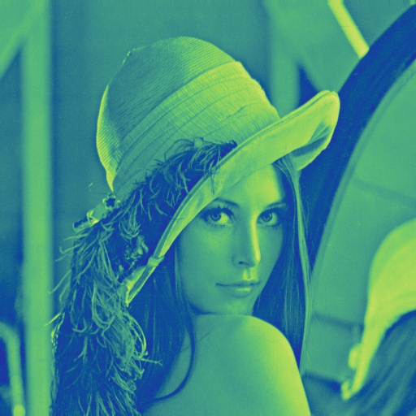
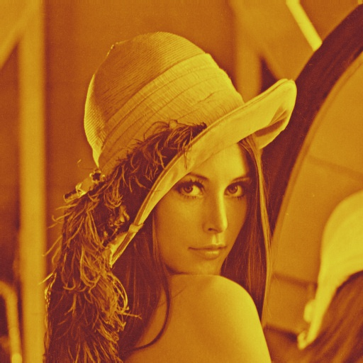

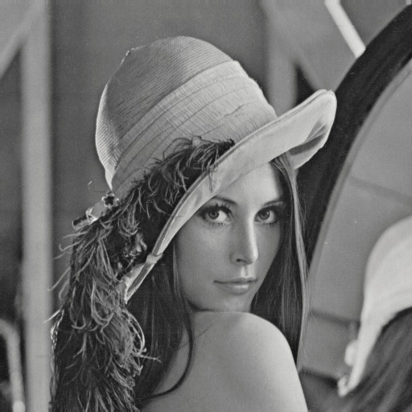

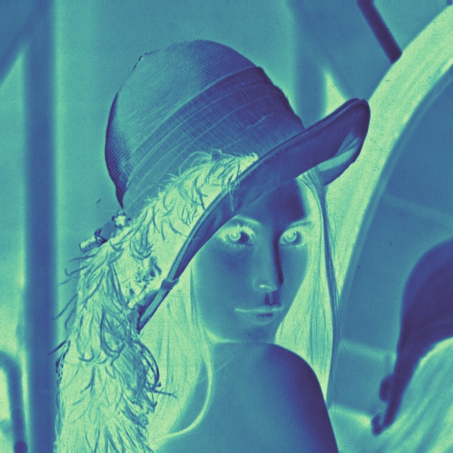
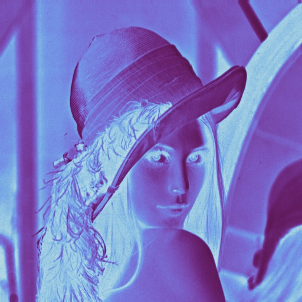
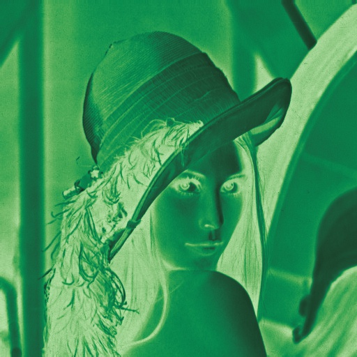
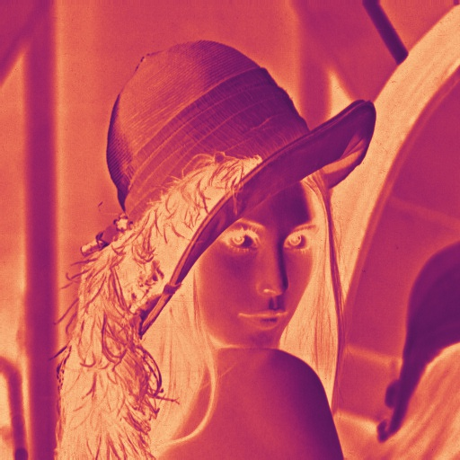
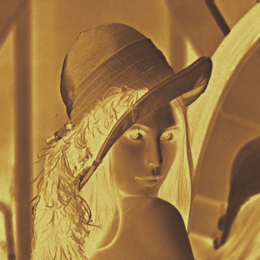
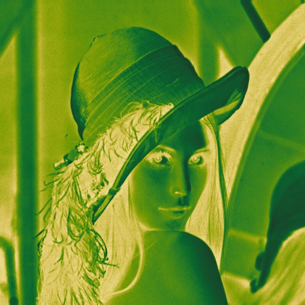
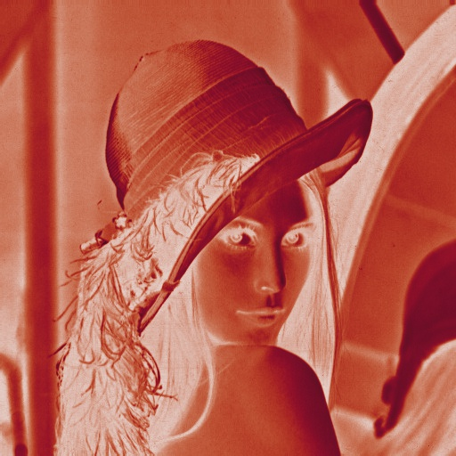
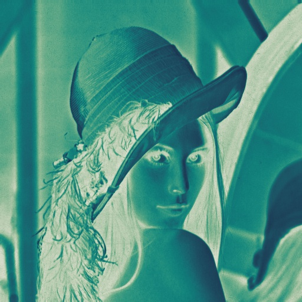
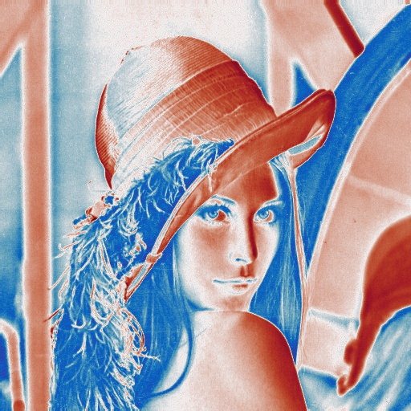
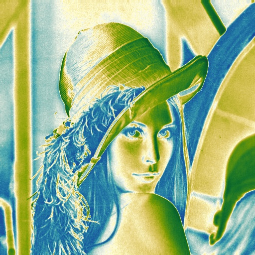
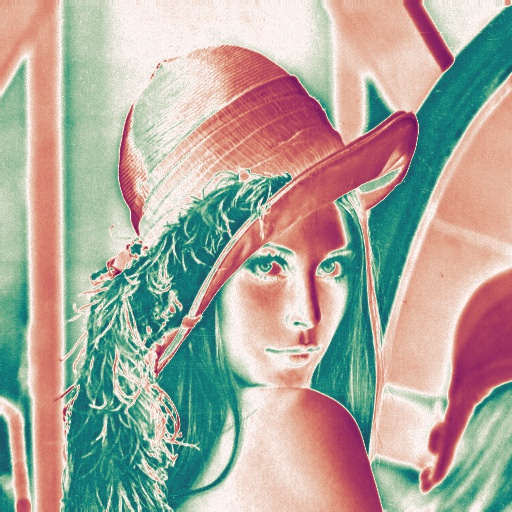

